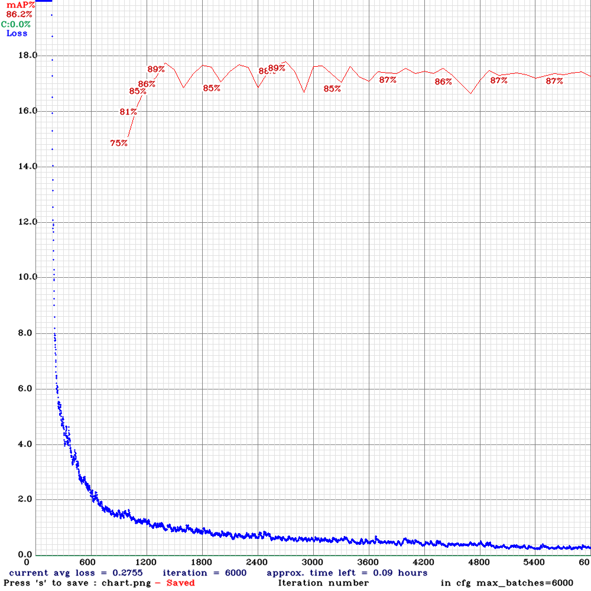
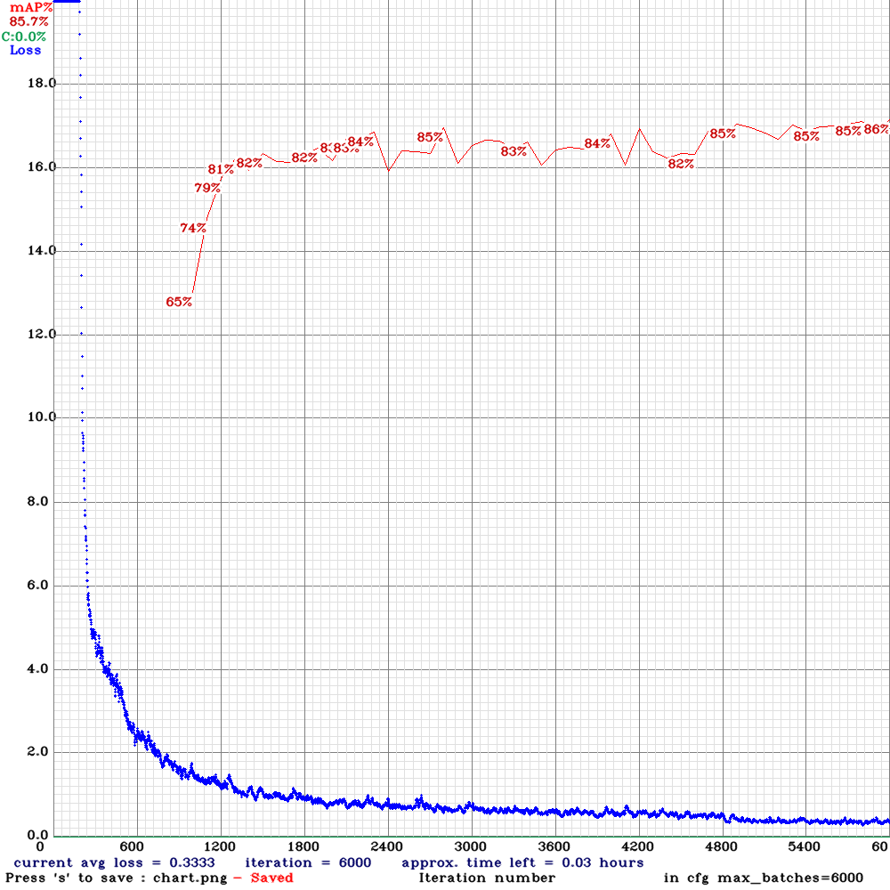

# Mask Detection with YOLOv3 using Custom Dataset

## Introduction:
The project was actually completed in October 2020 but forgot to upload it then.

The widespread of Covid-19 make it necessary for people to wear mask when they are outside. As such, I have decided to make a mask detection model which aims to ensure people wear their mask when they are outside of their homes.

This project is implemented using YOLOv3 (darknet) with my custom dataset made using LabelImg and the model is trained on Google Colab Telsa T4 GPU.

There are 3 versions of this project. Initially, for my first version, I started with only 343 images, of which there are 560 instances of mask and 229 instances of no mask. After training, I realised that there were a couple of issues. 

- While predictions on close-up faces are generally accurate, I realised that detections on faces that are small (far away from the camera), tend to perform much worse (often detecting that one is wearing a mask when he/she is not).
  - This can be due to training dataset, which have much more mask images than no-mask images.

- The model also wrongly detected that I am wearing a mask when I am drinking water from a cup (cup blocking my face partially).
  - This can be due to training dataset, which have much more mask images than no-mask images.

- The model fails to detect people who have darker skin compared to those with lighter skin
  - This can be due to training dataset, which have more images of people who are lighter skin.

- Slow detection time
  - Image size used for training is 608 x 608, leading to relatively longer detection time on my slow computer :(
  
To solve the issues stated above, I came out with more dataset (572 images, of which there are 786 instances of mask and 938 instances of no mask) for my second and third model.

Additionally, in my config file, I change image size used for training to 416 x 416 and 256 x 256 for mask_detection and mask_detection_v2 respectively. 

After training for the second and third time, I felt that the model became more accurate and the detection/training time is reduced significantly. 


| Model Used             | Image Size | Mask AP | No Mask AP | mAP   | Time(ms)  |   
| :--------------------: | :--------: | :-----: | :--------: | :---: | :---:     |
| detection_less_dataset | 608x608    | 92.4    | 88.3       | 90.4  | 71.25     |
| detection_v1           | 416x416    | 90.9    | 81.4       | 86.2  | 40.52     |
| detection_v2           | 256x256    | 90.1    | 81.3       | 85.7  | 8.5       |
###### Note: All the statistics above are from Google Colab with Tesla T4 GPU.


*mask_detection_v1 mAP and loss graph*


*mask_detection_v2 mAP and loss graph*

Although mask_detection_less_dataset model has the highest mAP, and the mAP of mask_detection_v1 and mask_detection_v2 are very similar, the best model is actually mask_detection_v1 (winning by a slight margin). This can be due to the following reasons:

- mask_detection_v1 is also more confident when detecting faces with/without masks. However, if confidence level is not a concern, mask_detection_v2 can also be a good choice.

- mask_detection_v1 tends to have less false positive on live videos. Due to the higher resolution of images being used to train mask_detection_v1, it is more able to differentiate whether a round object is actually a face. On the other hand, mask_detection_v2 tends to believe that objects in the background that are somewhat round in shape resemble a face, hence detecting them.However, when being tested on images, mask_detection_v1 tends to underestimate number of people present in the image as compared to mask_detection_v2.

## Results:
The performance of the various models can be seen in the output images located in the test_images_result of the respective models. All 3 models are being tested based on the same dataset, which consist of only images.

## Run Locally:

Clone the repository:
```
$ git clone https://github.com/spartan737/Mask-Detection-YOLOv3.git
```

Run utilities.py in order to:
- find the total number of images/labels used
- check that each image has a corresponding text file
- split images into training and testing dataset

Then, upload notebooks and images into Google Drive. Run the codes in the notebooks on Google Colab. Remember to change Runtime Type to GPU.

After training the model, download the weights into local computer. Transfer the weights to the directory of the model (example: mask_detection_YOLOv3\mask_detection_v1)

Since the size of the weights files exceeds the file limit for uploading to Github, please train your own model.

Detect people with/without masks using images:
```
# if planning to run mask_detection_v1 
$ py image_detector.py -i C:\Users\Acer\PycharmProjects\mask_detection_YOLOv3\test_images -o C:\Users\Acer\PycharmProjects\mask_detection_YOLOv3\mask_detection_v1\test_images_result  -w C:\Users\Acer\PycharmProjects\mask_detection_YOLOv3\mask_detection_v1\yolov3_last.weights -cfg C:\Users\Acer\PycharmProjects\mask_detection_YOLOv3\mask_detection_v1\darknet\cfg\YOLOv3.cfg -n C:\Users\Acer\PycharmProjects\mask_detection_YOLOv3\mask_detection_v1\darknet\data\obj.names
```


Detect people with/without masks using live camera:
```
# if planning to run mask_detection_v1 
$ py video_detector.py -w C:\Users\Acer\PycharmProjects\mask_detection_YOLOv3\mask_detection_v1\yolov3_last.weights -cfg C:\Users\Acer\PycharmProjects\mask_detection_YOLOv3\mask_detection_v1\darknet\cfg\yolov3.cfg -n C:\Users\Acer\PycharmProjects\mask_detection_YOLOv3\mask_detection_v1\darknet\data\obj.names -o C:\Users\Acer\PycharmProjects\mask_detection_YOLOv3\frame
```
If you plan to convert frames into video, run frames_into_videos.py

## License:
This project is under the [MIT](https://github.com/spartan737/mask_detection_YOLOv3/blob/main/LICENSE) license.
